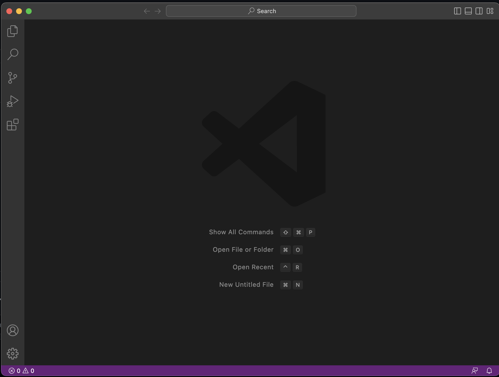
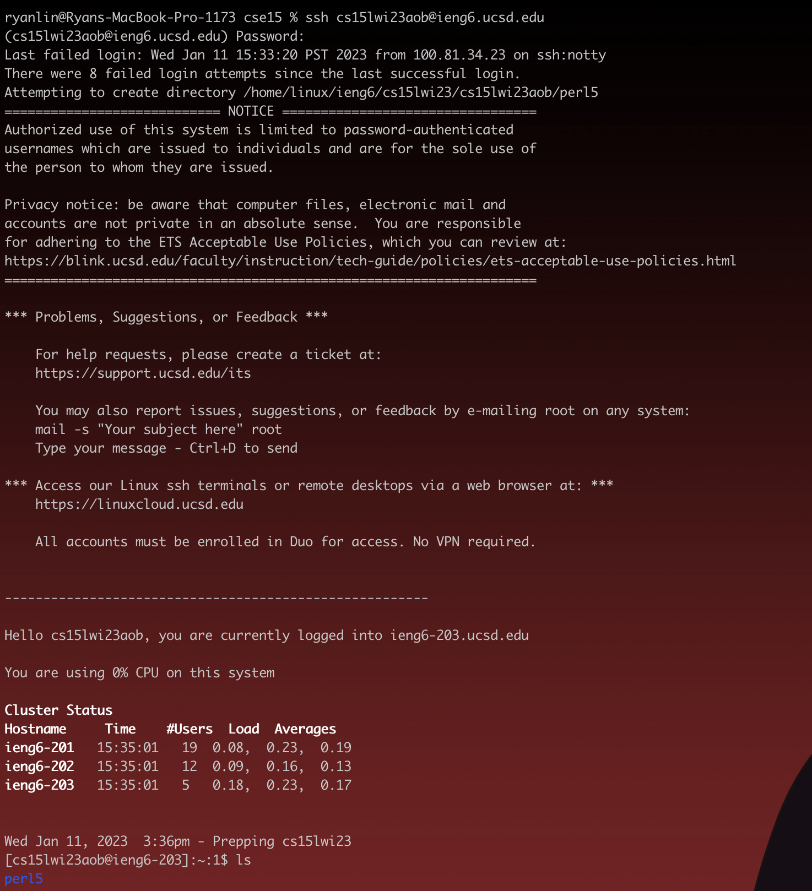
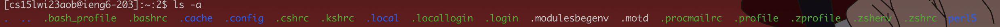
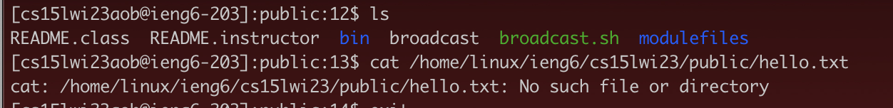
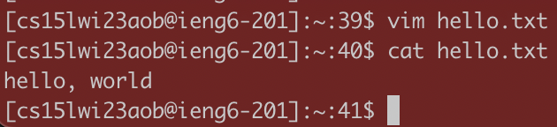
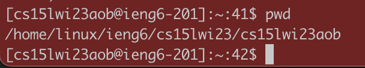

# Installing VSCode

First, I navigated to the vscode download webpage and downloaded the appropiate
vscode application. The website link can be found
here: [Link](https://code.visualstudio.com/)

After waiting for it to download, I opened up the application and screenshotted the
home screen, which looked like this:

# Remotely Connecting

In order to remotely connect, you must SSH into a remote server. SSH has its own
security protocol,
so you have to find/reset your login
here: [Link](https://sdacs.ucsd.edu/~icc/index.php).
After logging in with the ssh command and your username/password, you will be greeted
with a screen that looks like this:

# Trying Some Commands

After connecting, you should try out some commands and see what they do (examples
below).
In order to log out, you can either run the command Ctrl-D or exit.

In this command (ls -a), I listed the contents of the home directory including hidden
files

In this screenshot, I listed the files in the public directory using ls and ran cat
on a file (one of the suggested commands).
It is supposed to print the contents of the file.
Since the file did not exist, there was an error.

After creating a text file in my home directory using vim and running cat on that,
I am able to see the contents of it.

In this command, I ran pwd, which prints the current working directory. It shows that
I am in the home directory

