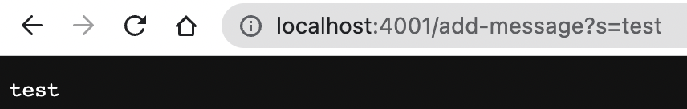
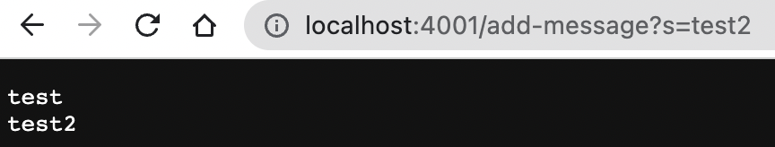
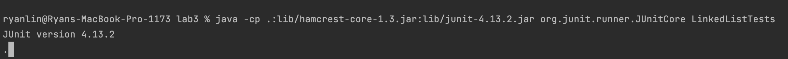
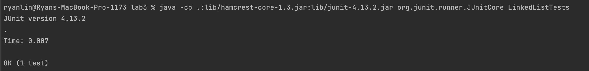

# Lab Report 2

## Part 1

Here is the code I wrote for the string server

```java
class StringHandler implements URLHandler {
    // The one bit of state on the server: a number that will be manipulated by
    // various requests.
    String soFar = "";

    public String handleRequest(URI url) {
        if (url.getPath().equals("/add-message")) {
            String[] parameters = url.getQuery().split("=");
            if (parameters[0].equals("s")) {
                soFar = soFar + parameters[1] + "\n";
            }
            return soFar;
        } else {
            return "404 Not Found!";
        }
    }
}

class StringServer {
    public static void main(String[] args) throws IOException {
        if (args.length == 0) {
            System.out.println("Missing port number! Try any number between 1024 to 49151");
            return;
        }

        int port = Integer.parseInt(args[0]);

        Server.start(port, new StringHandler());
    }
}
```

Here are the screenshots of using the string server:

In this screenshot, the method "handleRequest" is called. it takes a URI type
argument that contains the url that was called on the server, in this case "
localhost:4001/add-message?s=test".
The class contains
a string value "soFar" that stores the value of the string to display so far.
In this request, "test\n" was appended to soFar, which was an empty string.


In this screenshot, "handleRequest" was called again. It still takes a URI type
argument that contains the url that was called on the server. It is the same as the
last request, but "s=test" is replaced with "s=test1". soFar is still in
the class, except this time it starts with the value "test\n". In this request,
"test2\n" was appended to soFar to form "test1\ntest2\n", which is displayed on
the page.

Some other methods that are called in both cases:

1. "getPath" gets the path from the URI string
2. "getQuery" gets the query from the URI string
3. "split" splits the string passed in on a token and returns an array of strings. In
   this case, it splits the query string
4. "equals" tells whether a string is equivalent in value to another string

None of these methods by themselves modify any class variables directly, but they
contribute to
soFar getting set to the new value.

## Part 2

Failure inducing input:

```
    @Test
    public void testLinkedList() {
        LinkedList lst = new LinkedList();
        lst.append(0);
        lst.append(1);
        lst.append(2);
        assertEquals(lst.toString(), "0 1 2 ");
    }
```

Input that doesn't induce failure:

```
    @Test
    public void testLinkedListSuccess() {
        LinkedList lst = new LinkedList();
        lst.append(0);
        lst.append(1);
        lst.prepend(3);
        assertEquals(lst.toString(), "3 0 1 ");
    }
```

This is the output of the failure inducing test:

The symptom is that the program does not produce any output and is stuck like this,
which means that there is an infinite loop somewhere in the code.

This is the output of the passing test:


This is the before code:

```
while(n.next != null) {
            n = n.next;
            n.next = new Node(value, null);
        }
```

It is located in the append method, if there are at least 2 elements already in
the list (so it is triggered on the third append). In the current code, it sets
n.next to be a new node in the while loop, so n.next will never be null. This means
that there will be an infinite loop.

Here is the fix:

```
while(n.next != null) {
            n = n.next;
        }
        n.next = new Node(value, null);
```

I moved setting n.next to the outside of the loop, so it will just go to the end
of the linked list and add a new node to that only once.

After fixing the bug, both tests ran successfully.

## Part 3

In lab 3, I learned about how to pass in a function to a java method. At first,
I just defined a lambda function with arrow syntax (() -> {}), but I also figured out
how to construct an anonymous class to implement the interface and pass in a
function.