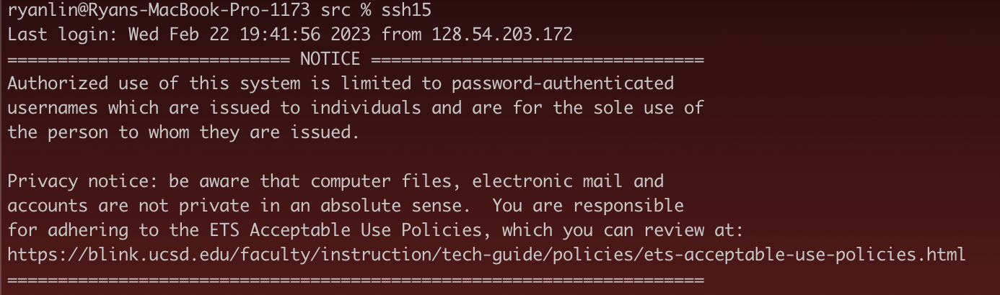
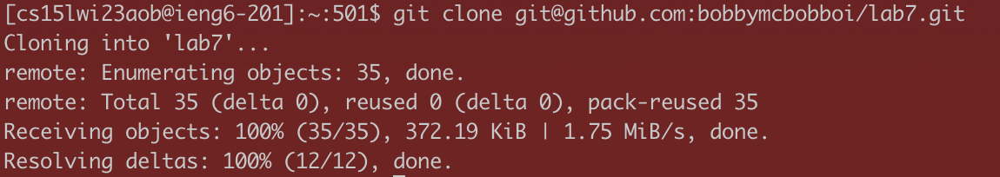
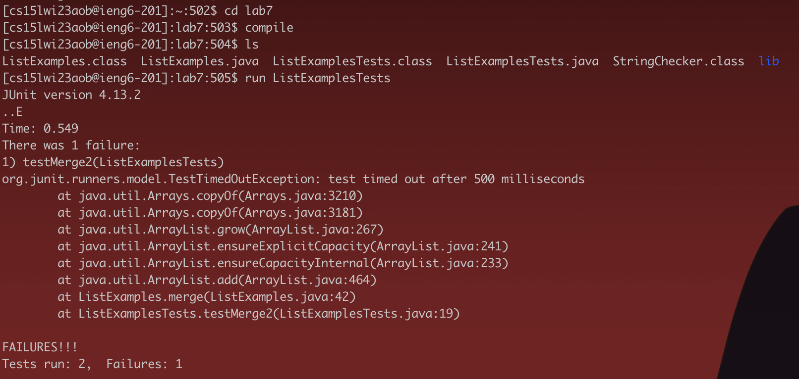
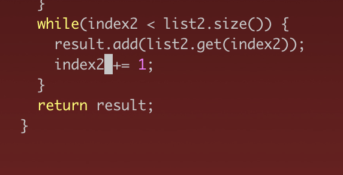
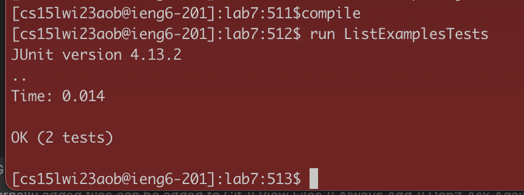
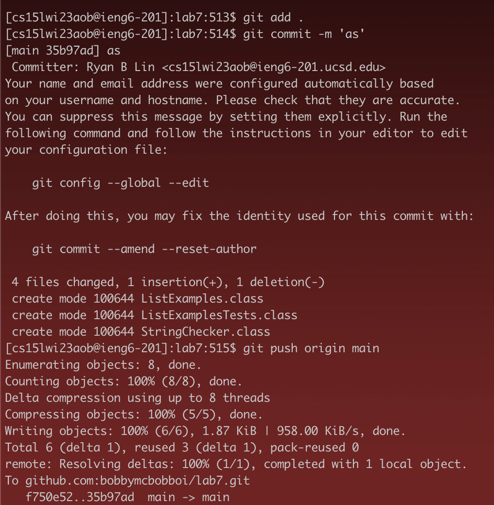

## Lab Report 4

Disclaimer: I obtained permission from the TAs for the use of aliases

Final time: 33 seconds

Step 4



```
ssh15
```

I set up an alias for 'ssh15' to map to 'ssh cs15lwi23aob@ieng6.ucsd.edu', so
it would be faster to type

Step 5



```
git clone <CMD> v
```

I already had the repository url in my clipboard, so I just had to type


Step 6



```
cd lab7
compile
ls
run List<tab>E<tab><backspace>
```

I first changed directory into lab7. I had previously set up an alias
for compile to map to javac with the libraries linked, I can just type compile.
I used ls to list the files (didn't do this in competition), and ran it with
another alias I had defined called run. I used tabs to complete the file names
(with a backspace to delete the period).

```
alias run='java -cp .:lib/hamcrest-core-1.3.jar:lib/junit-4.13.2.jar org.junit.runner.JUnitCore'
alias compile='javac -cp .:lib/hamcrest-core-1.3.jar:lib/junit-4.13.2.jar *.java'
```




```
vim List<tab>.<tab>
i<backspace>:wq<enter>
```

I used vim to edit the file. For some reason, the pointer is already at the 
necessary point (probably some cache in vim), so all I need to do is press i
to enter insert mode, replace index1 with index2, and exit by pressing :wq



```
compile
run List<tab>E<tab><backspace>
```

This is just compiling and running again, which I already explained above



```
git add .
git commit -m 'as'
git push origin main
```

I typed all these commands by hand. I just chose a random short commit message